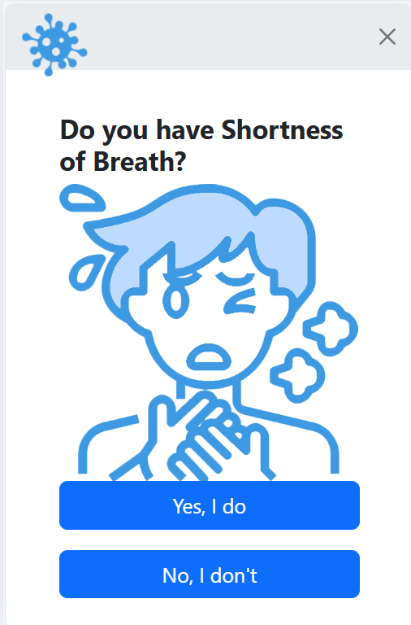

COVID-19 SELF ASSESSMENT TOOL:
This repository contains a simple self-assessment tool to help determine whether you may need to be tested for COVID-19. This tool guides you through a series of questions and provides recommendations based on your answers.
# Screenshots

# Start Screens

# Question 1: Do you have Fever above 101.4?

# Question 2: Do you have Cough (Dry Cough)?

# Question 3: Do you have Cough - (Wet Cough)?

# Question 4: Do you have Shortness of Breath?

# Question 5: Do you have Flu?

# Question 6: Have you travelled abroad in the last 15 days?

# Question 7: Have you been in contact with any person who has recently travelled internationally?

# Question 8: Do you have chest infection?

# Question 9: Is your age more than or equal to 60 years of age?

# Question 10: Due to Co-morbidities, do you take any medicine?

# Result Screen

## How to Use

1. **Start Screening**: Begin the self-assessment by clicking on the "Start Screening" button.
2. **Answer Questions**: Respond to the series of questions about your symptoms.
3. **Get Results**: Based on your answers, the tool will provide recommendations on whether you should seek further medical advice or testing.

## Instructions for Developers

To run the tool locally, clone this repository and open `index.html` in your preferred web browser.

